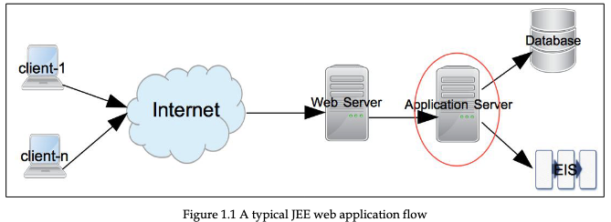

+++
archetype = "chapter"
title = "JEE"
weight = 30
isBoldTitle = true
+++

JEE est une collection de spécifications destinées à accomplir des tâches spécifiques. Ces spécifications sont définies par le programme Java Community Process (https://www.jcp.org).

Les spécifications JEE peuvent être classées dans les groupes suivants :
- Couche de présentation
- Couche métier
- Couche d'intégration à la base de données
  

1. Le client (e.g. Web) demande les services d'une application distance
2. La requête est d'abord reçu par un serveur web (e.g. Apache, Nginx)
3. Les requêtes dynamique nécessite généralement un serveur d'applications pour la traiter, d'où la nécessité de déployer sur un serveur JEE (e.g. WebSphere, GlassFish)
   - Accès à la base de données
   - Traitement des données
   - Retourner les données
