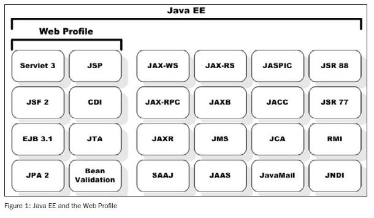

+++
title = "Serveurs d'application JEE"
weight = 20
+++

> [!ressource] Ressources
> - [L'environnement d'exécution des applications J2EE](https://www.jmdoudoux.fr/java/dej/chap-j2ee-javaee.htm#j2ee-javaee-3)

Il existe plusieurs conteneurs définis par J2EE:
- conteneur web : pour exécuter les servlets et les JSP
- conteneur d'EJB : pour exécuter les EJB
- conteneur client : pour exécuter des applications standalone sur les postes qui utilisent des composants J2EE

Les *serveurs d'applications* peuvent fournir un conteneur web uniquement (exemple : Tomcat) ou un conteneur d'EJB uniquement (exemple : JBoss, Jonas, ...) ou les deux (exemple : Websphere, Weblogic, ...).

## Web vs. Application Server

## Exemple de serveur web/application

| Server Name       | Type               | License     | Container Type    | Company/Organization       |
| ----------------- | ------------------ | ----------- | ----------------- | -------------------------- |
| WildFly           | Application Server | Open Source | Full Jakarta EE   | Red Hat                    |
| **Apache TomEE**  | Application Server | Open Source | Full Jakarta EE   | Apache Software Foundation |
| GlassFish         | Application Server | Open Source | Full Jakarta EE   | Eclipse Foundation         |
| WebSphere Liberty | Application Server | Commercial  | Full Jakarta EE   | IBM                        |
| WebLogic Server   | Application Server | Commercial  | Full Jakarta EE   | Oracle                     |
| Open Liberty      | Application Server | Open Source | Full Jakarta EE   | IBM                        |
| **Apache Tomcat** | Web Server         | Open Source | Servlet Container | Apache Software Foundation |
| **Jetty**         | Web Server         | Open Source | Servlet Container | Eclipse Foundation         |
