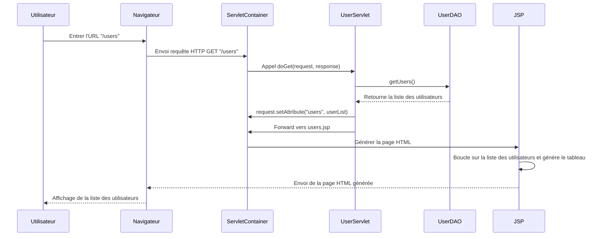

+++
title = "JSP"
weight = 20
+++

JSP (JavaServer Pages) est une technologie Java permettant de créer des pages web dynamiques en mélangeant du code HTML et du code Java.
- JSP est plus adapté pour gérer l’affichage et la mise en page, car il permet d’écrire directement du HTML avec des éléments dynamiques en Java.
- Dans une application bien structurée, on utilise les Servlets pour gérer la logique métier et la navigation, et les JSP pour afficher les résultats (pattern MVC).

```html
<<body>
    <h1>Welcome to My JSP Page</h1>
    
    <p>This is a simple JSP example.</p>
    
    <% 
    // Java code block
    Date currentDate = new Date();
    %>
    
    <p>Current date and time: <%= currentDate %></p>
    
    <h2>A simple loop:</h2>
    <ul>
    <% for(int i = 1; i <= 5; i++) { %>
        <li>Item <%= i %></li>
    <% } %>
    </ul>

    <!-- Bouton qui envoie une requête GET vers la servlet -->
    <form action="MyServlet" method="GET">
        <button type="submit">Go to Servlet</button>
    </form>

</body>
</html>
```

### Servlet et JSP code
Les deux code suivants sont identiques :
- le premier écrit avec JSP
- le second avec une servlet

```jsp
<!-- hello.jsp -->
<html>
<head><title>Exemple JSP</title></head>
<body>
    <h1>Bienvenue sur ma page JSP</h1>
    <p>Date actuelle : <%= new java.util.Date() %></p>
</body>
</html>
```

```java
@WebServlet("/hello")
public class HelloServlet extends HttpServlet {
    protected void doGet(HttpServletRequest request, HttpServletResponse response) throws ServletException, IOException {
        response.setContentType("text/html");
        PrintWriter out = response.getWriter();
        out.println("<html><head><title>Exemple Servlet</title></head><body>");
        out.println("<h1>Bienvenue sur ma page Servlet</h1>");
        out.println("<p>Date actuelle : " + new java.util.Date() + "</p>");
        out.println("</body></html>");
    }
}
```

## MVC en combinant JSP et Servlet
En introduction, nous disions que dans une application bien structurée, on utilise les Servlets pour gérer la logique métier et la navigation, et les JSP pour afficher les résultats (pattern MVC).
- Modèle (Model) : Classe `User` et `UserDAO` pour gérer les données.
- Contrôleur (Controller) : Servlet `UserServlet` qui gère la logique métier et envoie les données à la JSP.
- Vue (View) : JSP `users.jsp` qui affiche la liste des utilisateurs.

### Modèle
```java
public class User {
    private String name;
    private String email;
    // getter + setter
}

public class UserDAO {
    public static List<User> getUsers() {
        List<User> users = new ArrayList<>();
        users.add(new User("Alice", "alice@example.com"));
        users.add(new User("Bob", "bob@example.com"));
        users.add(new User("Charlie", "charlie@example.com"));
        return users;
    }
}
```

### Controller
```java
@WebServlet("/users")
public class UserServlet extends HttpServlet {
    protected void doGet(HttpServletRequest request, HttpServletResponse response) throws ServletException, IOException {
        // Récupérer la liste des utilisateurs depuis le modèle (UserDAO)
        List<User> userList = UserDAO.getUsers();

        // Ajouter la liste en tant qu'attribut de la requête
        request.setAttribute("users", userList);

        // Rediriger vers la JSP pour afficher les résultats
        request.getRequestDispatcher("users.jsp").forward(request, response);
    }
}
```

### Vue
```jsp
<!-- users.jsp -->
<%@ page contentType="text/html; charset=UTF-8" pageEncoding="UTF-8" %>
<%@ page import="java.util.List" %>
<%@ page import="User" %>
<html>
<head>
    <title>Liste des Utilisateurs</title>
</head>
<body>
    <h1>Liste des Utilisateurs</h1>
    <table border="1">
        <tr>
            <th>Nom</th>
            <th>Email</th>
        </tr>
        <%
            List<User> users = (List<User>) request.getAttribute("users");
            for (User user : users) {
        %>
        <tr>
            <td><%= user.getName() %></td>
            <td><%= user.getEmail() %></td>
        </tr>
        <%
            }
        %>
    </table>
</body>
</html>
```

### Diagramme de séquence

